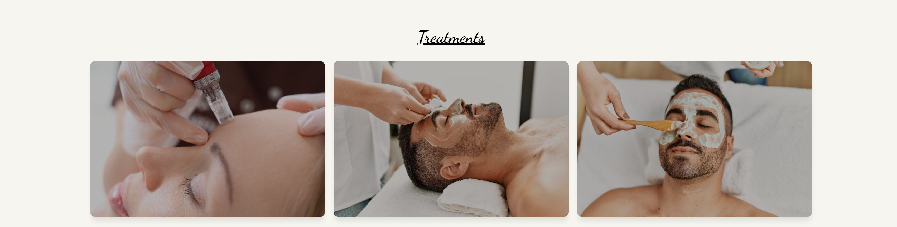

# Dermatology Clinic Website
Bella's Clinic is a dermatology website offering skincare treatments. Users can explore treatments, meet staff, find the clinic's location, and schedule sessions

## Features
This website was designed with responsive, simplistic and clear features that will help users navigate through the website for the information needed at ease

### Existing Features

- __Navigation menu__

   - Featured on all three pages, the full responsive navigation 
    bar includes links to the Logo, Home page, Booking page, and Contact page and is 
    identical in each page to allow for easy navigation
   - The navigation menu is responsive even on small screen devices

#### Nav-bar :

#### Phone devices will show a hamburger menu, which will open up a drop down menu when clicked :

- __Header__

   - Opening page header include a background of a facial treatment and a find out more button, when clicked it redirects the user to a page that introduces our various treatments and a booking button for each treatment where the user can schedule a session
  

- __Treatments__
   
   - 3 panel section is included in the home page, when hovered over gives an effect where if clicked it redirects the user to that specific treament section in the Booking page
   - Provides the user with short vital information about the treatments Bella's clinic offers

- __Video__
  -  A playable video of a patient getting their skin treated with one of our treatments

  

  - __Our Staff Section__
   - Includes 3 images of the staff working at the clinic
   - Text underneath each image providing the staff's names

 

- __Footer__

  - Footer section that's spread out across all pages, includes all social media links to the clinic
  - Includes the location to the clinic and the clinic's logo

  

  - __Book Page__

   - Provides user with detailed information regarding the various treatments we offer
   - Images of the treatments
   - Book button that redirects the user to that specific treatments booking page

  

   - __Contact Us Page__

   - Provides user with a form that user can utilitse to reach out to us
   - Provides user with the opening hours of the clinic

 

## Features left to implement

   - Add Google Map embedd of the our location to the Contact US page
   - Add styling and header the video in the home page

## Testings

  All site features and interactivity function as intended, scrolling through the site functions smoothly, buttons take the user to where they want to go, navigation
  menu helps the user towards the section they seek after. 

   